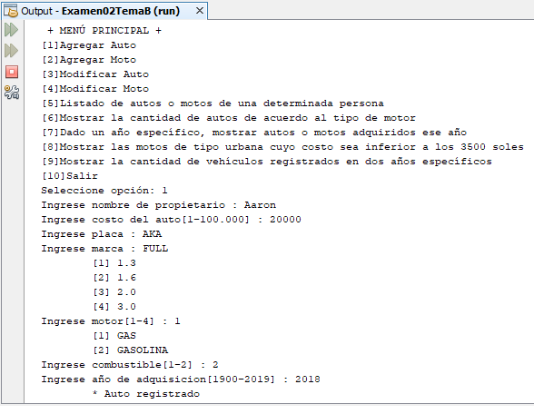

# Sistema de control de vehículos
Sistema sobre una Concesionaria con herencia múltiple donde se puede registrar un auto, registrar una moto, modificar un auto, modificar una moto, listado de autos o motos de una determinada persona, mostrar la cantidad de autos de acuerdo al tipo de motor, mostrar autos o motos adquiridos en un año ingresado, mostrar las motos de tipo urbana cuyo costo sea inferior a los 3500 soles y mostrar la cantidad de vehículos registrados en dos años específicos, **23/12/19**.

<strong>Imagen:</strong> Menú principal - Agregar Auto.

